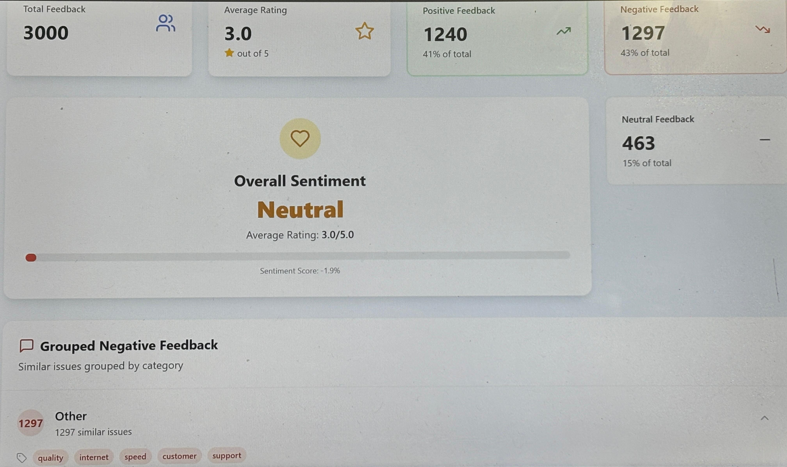

A full-stack project that analyzes customer feedback using Machine Learning (FastAPI backend + React frontend).
It provides sentiment analysis, visual analytics, and grouped feedback insights for businesses to better understand customer experience.

🚀 Features

🔹 FastAPI Backend

Sentiment prediction using a trained ML model (scikit-learn + NLP preprocessing).

REST APIs for analyzing individual feedback (/analyze) and datasets (/dataset).

CSV dataset integration (Vodafone feedback sample included).

🔹 React + Vite Frontend

Modern TypeScript + TailwindCSS UI.

Interactive dashboard with analytics (positive, neutral, negative feedback).

Visual charts for overall sentiment & grouped negative feedback.

Fetches real-time results from backend APIs.

🔹 ML/NLP Pipeline

Text preprocessing (stopwords removal, tokenization, lemmatization).

Trained vectorizer & sentiment classifier.

Automatic feedback categorization with common keyword extraction.

🏗️ Tech Stack

Frontend:

⚛️ React + TypeScript (Vite)

🎨 TailwindCSS + Lucide Icons

Backend:

⚡ FastAPI

🐍 Python (pandas, scikit-learn, nltk)

🔄 CORS-enabled API for React integration

Dataset:

Vodafone customer feedback (vodafone_feedbacks.csv)

📂 Project Structure
Customer Experience Analytics Dashboard/
│── backend/                # FastAPI app + ML model
│   ├── main.py              # API routes
│   ├── preprocess.py        # Text preprocessing
│   ├── sentiment.py         # Sentiment prediction
│   └── models/              # Trained model .pkl
│
│── frontend/               # React + Vite app
│   ├── src/
│   │   ├── components/      # Dashboard UI components
│   │   ├── pages/           # Feedback Dashboard
│   │   ├── utils/           # feedbackAnalyzer.ts
│   │   └── api/             # API calls to backend
│
│── dataset/
│   └── vodafone_feedbacks.csv
│
│── images/                 # (Place screenshots here for README)
│── README.md

⚡ Getting Started
1️⃣ Clone the repository
git clone https://github.com/your-username/your-repo.git
cd Customer-Experience-Analytics-Dashboard

2️⃣ Backend Setup (FastAPI)
cd backend
pip install -r requirements.txt
uvicorn main:app --reload --port 8000

Backend will run at 👉 http://127.0.0.1:8000

API docs available at 👉 http://127.0.0.1:8000/docs

3️⃣ Frontend Setup (React + Vite)
cd frontend
npm install
npm run dev
📊 Example API Usage
POST /analyze
{
  "text": "The customer service was amazing and very quick."
}

Response

{
  "feedback": "The customer service was amazing and very quick.",
  "sentiment": "positive",
  "summary": "The customer service was amazing and very quick"
}

GET /dataset

Returns all dataset feedback with predicted sentiments.

Frontend will run at 👉 http://localhost:5173
